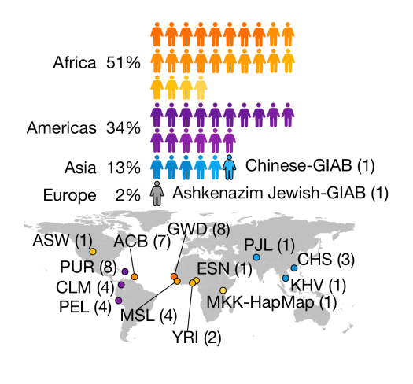

## Population (pan)genomics 

Welcome to the practical exercises section of the population genomics section of the [evomics2024](https://evomics.org/2024-workshop-on-genomics/) course. This page is designed to guide you through the basics and provide instructions on how to effectively run the tutorial. You'll find step-by-step guidance to familiarize yourself with the concepts and tools used in the exercises. 

## The HPRC data set 
For this tutorial we will use data produced by the [Human Pangenome Reference Consortium](https://humanpangenome.org/)

> The Human Pangenome Reference Consortium (HPRC) is a project funded by the National Human Genome Research Institute to sequence and assemble genomes from individuals from diverse populations in order to better represent genomic landscape of diverse human populations.

The data required for our exercises can be downloaded from the Human Pangenome Reference Consortium (HPRC) Year 1 Data Freeze, accessible [here](https://github.com/human-pangenomics/HPP_Year1_Data_Freeze_v1.0). Additionally, a broader range of data and software developed by the HPRC is available [here](https://github.com/human-pangenomics), offering extensive resources for your research and learning needs.

The HPRC dataset includes samples from diverse geographical origins. The selection of 47 samples was guided by various criteria: trio status in the Coriell biobank influencing the inclusion of Europeans, low cell line passage count affecting European samples, a focus on genetic diversity leading to a larger representation of Africans, and considerations of genetic drift impacting the selection of Asian and American samples. 

**For this tutorial, we will specifically focus on two continental populations, grouping individuals from Africa (AFR) and the Americas (AMR), to illustrate key concepts.**

<!---  https://www.nature.com/articles/s41586-023-05896-x#Fig1-->

## Tutorial sections 

|Section | Content | link |
|--------------|:-----:|-----------:|
|0 | Getting started |[link](tutorialsections/0.dat.md) |
|1 | Allele frequency, site frequency spectrum | [link](tutorialsections/1.afs.md)| 
|2 | Fst  and pangenome graph inspection| [link](tutorialsections/2.fst.md)| 
|3 | Principal component analysis | [link](tutorialsections/3.pca.md)| 
<!--|4 | Tajima's D | [link](tutorialsections/4.taj.md)|--> 
<!--|5 | population structure  | [link]()|--->

## Software we will use for this tutorial 

`plink` https://www.cog-genomics.org/plink/2.0/

`vcftools` https://vcftools.github.io/documentation.html

`bcftools` https://samtools.github.io/bcftools/bcftools.html

`odgi`  https://pangenome.github.io/odgi.github.io/

`bandage` https://rrwick.github.io/Bandage/

`R` During the exercise, calculations are typically performed, and to visualize the results, you may use your preferred plotting tools or the R code available in the `rscripts` folder. These R scripts can be executed directly from the command line. Alternatively, if you prefer a more interactive approach, you can upload your data into RStudio. There, you have the option to either write your own code or modify and reuse the code provided in the scripts

#### Authors 

_Enza Colonna, Miloš Duchoslav, Erik Garrison, Silvia Buonaiuto, chatGTP, Jose Costa_ 
