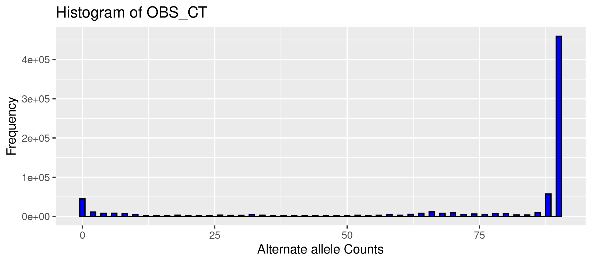
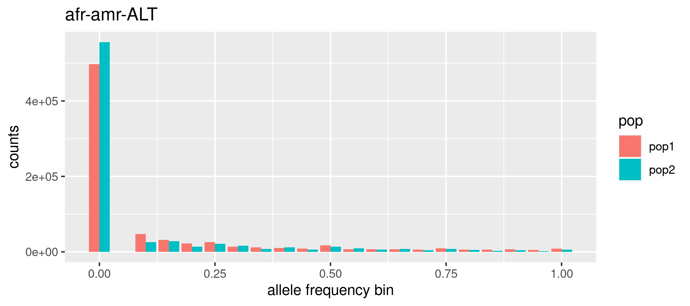

## 1. Allele frequencies and Allele Frequency Spectrum (AFS) 
Allele frequency is a frequency of given variant in a population. The Allele Frequency spectrum (AFS, or Site Frequency Spectrum) is a histogram that describes the number of genetic variants with a given frequency in a set of sequences. It can be used to estimate the dynamics of the population (expansion, bottleneck etc.).

In this part of the tutorial, we are going to learn how to analyze and show the differences in allele frequencies between Africans and Americans individuals in the HPRC dataset. By the end of this tutorial, we should have a graph that shows how these gene frequencies vary between the two groups, e.g. which population is enriched for rare variation, giving us a concise picture of genetic diversity betwee these two populations.

We will learn how to: 
- (a) calculate allele frequencies using `plink2` 
- (b) calculate population-specific allele frequencies
- (c) how to bin allele frequencies to plot the allele frequency spectra (AFS)


#### Navigate to the folder `1_afs` within the `mytutorial` folder 

```shell
cd mytutorial
cd 1_afs
```

***
### (a) Overall allele frequencies and histogram of allele counts 
Calculate allele frequencies directly from vcf, only for the SNPs, for all samples.

``` shell
plink2 --vcf /home/genomics/workshop_materials/population_genomics/chr15.pan.fa.a2fb268.4030258.6a1ecc2.smooth.reliable.vcf.gz \
       --freq \
       --allow-extra-chr \
       --vcf-half-call m \
       --snps-only \
       --out chr15

## --vcf loads a genotype VCF file
## --allow-extra-chr  force to accept chromosome code 'chm13#chr15'
## --vcf-half-call specify how GT half-call should be processed. See tutorial section 0 for more info
## --snps-only  selects only loci that are single nucleotide polymorphisms 
## --out gives a human-readable name 

```

This command will produce these files: 

```shell
-rw-rw-r-- 1 enza enza 33492352 gen 14 11:28 chr15.afreq
-rw-rw-r-- 1 enza enza      923 gen 14 11:28 chr15.log
```

Open the `.log` file  and read it to check that all went well. 

Open the `.afreq` file and look at it. Check the [info](https://www.cog-genomics.org/plink/2.0/formats#afreq) on the content of the columns and get familiar with it:  

```shell 
cat chr15.afreq | column -t | less -S 
```

> _Can you guess why for some loci the allele frequency is null (nan)?_ 

Plot the counts of the alternate allele to obtain the allele frequency spectrum from the alternate allele counts: 

```shell 
 Rscript  ../../rscripts/1.plotafsCOUNTS.R chr15.afreq HPRC-allele-counts

## first argument is the file with the allele counts 

## second argument is the title of the graph
```
Open the file with the plot: 



***
### (b) Population-specific allele frequencies 
Next we want to calculate allele frequencies specifically for the African and American populations. This time we will use the `plink2` fileset instead of the `vcf`. 

The crucial first step involves identifying the samples that belong to these specific populations. This information is in metadata files that we need to reference using the `--keep` option:  

```shell
plink2 --pfile  ../data/chr15 \
       --keep  ../../metadata/afr.onlyid \
       --freq \
       --allow-extra-chr \
       --snps-only \
       --out chr15.afr 

plink2 --pfile  ../data/chr15 \
       --keep  ../../metadata/amr.onlyid \
       --freq \
       --allow-extra-chr \
       --snps-only \
       --out chr15.amr 

## --pfile specifies which plink2 file set to use, you only need to specify the file prefix (e.g. chr15) 
## --keep reference to the file containing the individuals to filter for (i.e. keep only individuals listed in the file)
## Note that we are filtering for individuals from African (afr) and the Americas (amr).
```

This will produce: 
```shell
-rw-rw-r-- 1 enza enza 32483032 gen 14 11:38 chr15.afr.afreq
-rw-rw-r-- 1 enza enza      863 gen 14 11:38 chr15.afr.log
-rw-rw-r-- 1 enza enza 30547659 gen 14 11:38 chr15.amr.afreq
-rw-rw-r-- 1 enza enza      863 gen 14 11:38 chr15.amr.log

```

As usual, open the log and check for error messages if any. 
Open the `.afreq` files and look at the content
 
***
### (c) Allele Frequency Spectrum (AFS) of multiple populations 
To produce the AFS we should bin the allele frequencies in classes. In plink2, the `--freq` option includes the `refbin` (bin by the reference allele) and `alt1bin` (bin by the alternative allele) modifiers for generating histogram counts during allele frequency calculations. To use these modifiers, you must specify the bin intervals either directly in the command line or by referencing a file, and using the `refbin-file` and `alt1bin-file` modifiers. 

We can produce the bin info file with a simple shell command that write a sequence form 0.1 to 1 in intervals of 0.05 and store it in a file called `mybins.txt`: 
 
```shell
LC_NUMERIC="C" seq -s " " 0.05 0.05 1.0 > mybins.txt
````

Look at the `mybins.txt` file so you better understand what the code above did:

```shell
cat mybins.txt 
```

***
Calculate the counts for the AFS based on alternate allele frequencies:  

```shell
plink2 --pfile  ../data/chr15 \
       --keep  ../../metadata/afr.onlyid \
       --freq alt1bins-file='mybins.txt' \
       --allow-extra-chr --snps-only \
       --out chr15.afr

plink2 --pfile  ../data/chr15 \
       --keep  ../../metadata/amr.onlyid \
       --freq alt1bins-file='mybins.txt' \
       --allow-extra-chr \
       --snps-only \
       --out chr15.amr

## --freq alt1bins-file='mybins.txt' specify to bin the frequency as described in the file mybins.txt 

```
These commands will produce:

```shell 
-rw-rw-r-- 1 enza enza      213 gen 16 09:43 chr15.afr.afreq.alt1.bins
-rw-rw-r-- 1 enza enza      212 gen 16 09:43 chr15.amr.afreq.alt1.bins
```

Look at the files `chr15.afr.afreq.alt1.bins` and `chr15.afr.afreq.alt1.bins`. To plot the AFS, we will use `R`. You can load the two files in `Rstudio` and write your own code (using ggplot - from what you learned earlier in the week!) or use the pre-prepared R script `1.plotafs.R` in the `../../rscripts` folder. Note that you can use the `Rscript` command to execute R scripts directly from the command line without the need for an interactive R environment.

```shell
Rscript ../../rscripts/1.plotafsFREQ.R chr15.afr.afreq.alt1.bins chr15.amr.afreq.alt1.bins afr-amr-ALT

# first argument is the allele frequency in the first population 

# second argument is the allele frequency in the second population 

# third argument is the title of the graph, I chose afr-amr to remember the name of the populations and ALT
# to remember that we are considering the Alternate allele frequency. Do not use spaces if multiple words! 

```

Look at the `png` file just produced. To view the png image, you can use Guacamole desktop or copy the file to your laptop using `scp` command.



#### Which population is enriched for rare variants? Can you guess why? 
