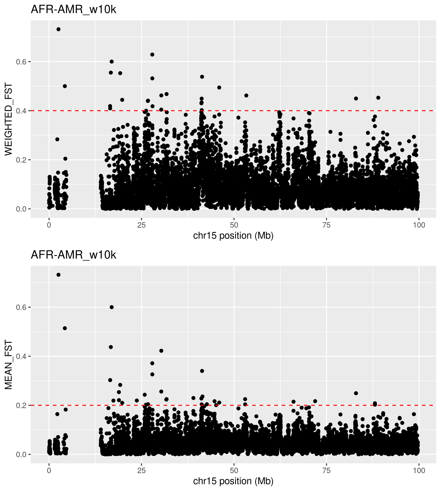

##  Population differentiation 
Fst is a statistical measure that tells us how different two or more groups of people are at the genetic level. It can be calculated for a single locus, over a windowd (average across loci in the window), or across the entire genome. 

In this session, we are going to explore how Africans and Americans differ in allele frequencies along chromosome 15. Our main task is to understand where these genetic differences occour and - possibly- why they matter. Knowing these differences but also about learning how they could affect health and diseases in various groups.

We will learn how to calculate Fst between two populations using `vcftools`, how to visualize these differences, and how to look up for genomic annotations at these highly diverging loci. 


#### Navigate to the folder `2_fst` within the `mytutorial` folder 

```shell
cd mytutorial
cd 2_fst
```

## Fst calculation 
Evaluate at which loci on chromosome 15 the Africans and Americans in the HPRC differ using [vcftools](https://vcftools.github.io/). Calculate Fst index ( Weir and Cockerham’s, 1984 [PMID:28563791](https://pubmed.ncbi.nlm.nih.gov/28563791/)) along the chromosome in windows of 10,000 bp: 


```shell
vcftools --gzvcf /home/genomics/workshop_materials/population_genomics/chr15.pan.fa.a2fb268.4030258.6a1ecc2.smooth.reliable.vcf.gz \
    --weir-fst-pop ../../metadata/afr.onlyid\
    --weir-fst-pop ../../metadata/amr.onlyid \
    --fst-window-size 10000 \
    --out afr-amr.w10k 

## --weir-fst-pop specify a file that contain lists of individuals (one per line) that are members of a population. 
## The function will work with multiple populations if multiple --weir-fst-pop arguments are used.

## --fst-window-size indicate the size of the window in base pairs.

## --out afr-amr.w10k  give a meaningful name to the output, I choose the population pair 'afr-amr', 'w' for windows, '10k' window size. 
## It could be called 'banana', it won't matter.
```

This will produce: 

```shell
-rw-rw-r-- 1 enza enza    866 gen 14 11:42 afr-amr.w10k.log
-rw-rw-r-- 1 enza enza 455476 gen 14 11:42 afr-amr.w10k.windowed.weir.fst

```

As usual, read the log file very well **before** looking at the results. After that look at the results: 

```shell
cat afr-amr.w10k.windowed.weir.fst | column -t | less -S 

## the column -t indent the columns to improve readability 
```

You should see this: 

```shell
CHROM        BIN_START  BIN_END   N_VARIANTS  WEIGHTED_FST  MEAN_FST
chm13#chr15  20001      30000     212         0.032207      0.01353
chm13#chr15  30001      40000     253         0.0235088     0.0150361
chm13#chr15  40001      50000     212         0.00531486    0.00804097
chm13#chr15  50001      60000     209         0.0359234     0.0172863

```
The first line of the files says that: _In the first 10kb from 20001 to 30000 there are 212 variants and the weighted avearge Fst is 0.3_

`vcftools` reads the input VCF file and for each site (SNP), it calculates the allele counts and frequencies in each population. It then computes the expected heterozygosity (H_e), observed heterozygosity (H_o), and the number of polymorphic sites (S) for each population.

The **FST** is calculated using the following formula:
> F_ST = (Σ_i (H_e_i - H_o_i) / H_e_i) / (Σ_i S_i / (n_i*(n_i - 1)))
where i represents each population, H_e_i is the expected heterozygosity, H_o_i is the observed heterozygosity, S_i is the number of polymorphic sites, n_i is the number of individuals in the population, and the summation is over all populations.


The **Weighted FST** is then computed by multiplying the unweighted FST by the harmonic mean of the number of individuals in each population: 
> F_ST_W = F_ST * (n_1 * n_2 * ... * n_k) / (Σ_i n_i)
where k is the number of populations, and n_i is the number of individuals in population i.


***
## Fst along the chromosome 
The following step is to create a plot of the results, offering an at-a-glance overview of the chromosome's status. Key information for this plotting process can be found in the script `../../rscript/2.plotFst.R`. You have the option to either run this script as is or use it as a reference to develop your own code, depending on your preference and coding style.

```shell
Rscript ../../rscripts/2.plotFst.R afr-amr.w10k.windowed.weir.fst   AFR-AMR_w10k 0.40 0.20 

## first argument is the Fst result file 

## second argument is the title of the graph, you choose it, can be 'banana', just do not use space if multiple words 

## the third argument '0.40' tells R to write in a file all loci with WEIGHTED_FST  > 0.40

## the third argument '0.40' tells R to write in a file all loci with MEAN_FST  > 0.20
```

This will produce: 

```shell
-rw-rw-r-- 1 enza enza   1922 gen 15 11:15 afr-amr.w10k.windowed.weir.fstAFR-AMR_w10k.highFst
-rw-rw-r-- 1 enza enza 141494 gen 15 11:15 afr-amr.w10k.windowed.weir.fstAFR-AMR_w10k.png

```

Open png file: 



***
## Look up for highly differentiated regions 


Now look at the interesting regions in the **pangenome graph** 
Open the `.highFst` file
 


<!---GOLGA8 https://www.ncbi.nlm.nih.gov/pmc/articles/PMC4244265/---> 

