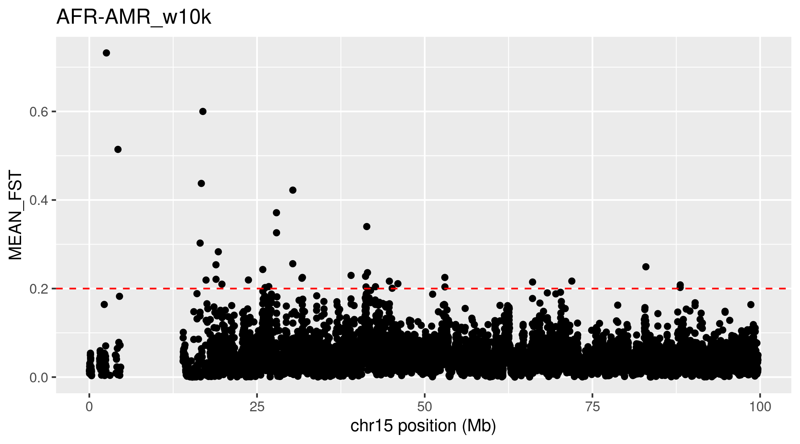

##  Population differentiation 

Navigate to the folder `2_fst` within the `mytutorial` folder 

```shell
cd mytutorial
cd 2_fst
```


Evaluate at which loci on chromosome 15 the AFR and AMR differ using [vcftools](https://vcftools.github.io/) to calculate Fst index ( Weir and Cockerham’s, 1984 [PMID:28563791](https://pubmed.ncbi.nlm.nih.gov/28563791/)) along the chromosome. Fst can be calculate at every locus or in window of a certain size: 


```shell
vcftools --gzvcf /home/genomics/workshop_materials/population_genomics/chr15.pan.fa.a2fb268.4030258.6a1ecc2.smooth.reliable.vcf.gz \
    --weir-fst-pop ../../metadata/afr.onlyid\
    --weir-fst-pop ../../metadata/afr.onlyid \
    --fst-window-size 10000 \
    --out afr-amr.w10k 

## --weir-fst-pop specify a file that contain lists of individuals (one per line) that are members of a population. The function will work with multiple populations if multiple --weir-fst-pop arguments are used

## --fst-window-size indicate the size of the window in base pairs 

## --out afr-amr.w10k  give a meaningful name to the output, I choose the population pair 'afr-amr', 'w' for windows, '10k' window size. it could be called 'banana', it won't matter 
```

<!--
vcftools --gzvcf ../data/chr15.pan.fa.a2fb268.4030258.6a1ecc2.smooth.reliable.vcf.gz   --weir-fst-pop ../data/pop/afr.onlyid --weir-fst-pop ../data/pop/amr.onlyid --out afr-amr.w10k  --fst-window-size 10000
---> 

This will produce: 

```shell
-rw-rw-r-- 1 enza enza    866 gen 14 11:42 afr-amr.w10k.log
-rw-rw-r-- 1 enza enza 455476 gen 14 11:42 afr-amr.w10k.windowed.weir.fst

```

As usual read the log file very well **before** looking at the results. After that look at teh results: 

```shell
cat afr-amr.w10k.windowed.weir.fst | column -t | less -S 

## the column -t indent the columns to improve readability 
```

You shoudl see this: 

```shell
CHROM        BIN_START  BIN_END   N_VARIANTS  WEIGHTED_FST  MEAN_FST
chm13#chr15  20001      30000     212         0.032207      0.01353
chm13#chr15  30001      40000     253         0.0235088     0.0150361
chm13#chr15  40001      50000     212         0.00531486    0.00804097
chm13#chr15  50001      60000     209         0.0359234     0.0172863

```
_In the first 10kb from 20001 to 30000 there are 212 variants and the weighted avearge Fst is 0.3_

***
The following step is to create a plot of the results, offering an at-a-glance overview of the chromosome's status. Key information for this plotting process can be found in the script `../../rscript/2.plotFst.R`. You have the option to either run this script as is or use it as a reference to develop your own code, depending on your preference and coding style.

```shell
Rscript ../../rscripts/2.plotFst.R afr-amr.w10k.windowed.weir.fst   AFR-AMR_w10k 0.20

## first argument is the Fst result file 

## second argument is the title of the graph, you choose it, can be 'banana', just do not use space if multiple words 

## the thrid argument '0.20' tells R to write in a file all loci with Fst > 0.20
```

This will produce: 

```shell
-rw-rw-r-- 1 enza enza   1922 gen 15 11:15 afr-amr.w10k.windowed.weir.fstAFR-AMR_w10k.highFst
-rw-rw-r-- 1 enza enza 141494 gen 15 11:15 afr-amr.w10k.windowed.weir.fstAFR-AMR_w10k.png

```

Open png file: 



***
look for interesting regions in the **pangenome graph** 
Open the `.highFst` file
 


<!---GOLGA8 https://www.ncbi.nlm.nih.gov/pmc/articles/PMC4244265/---> 

