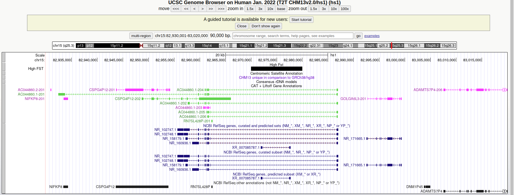
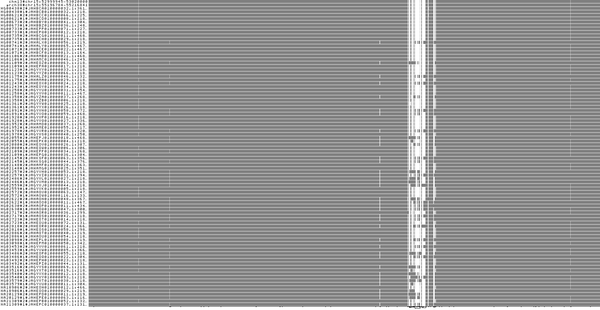
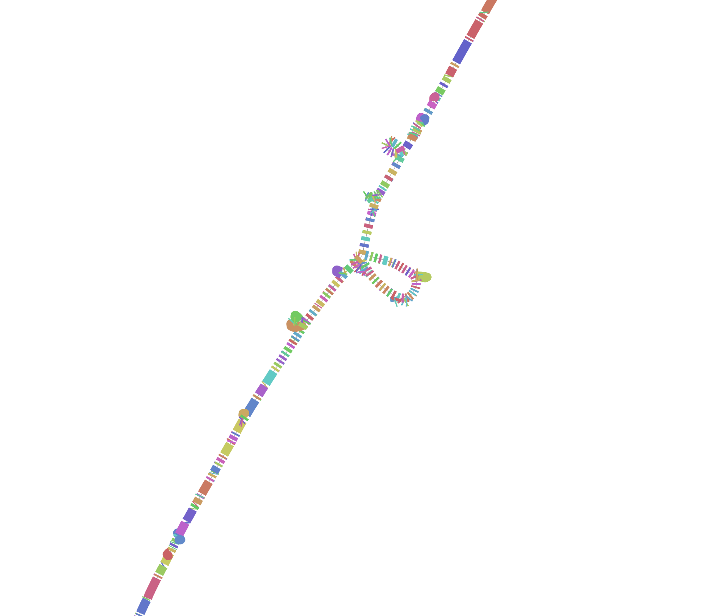
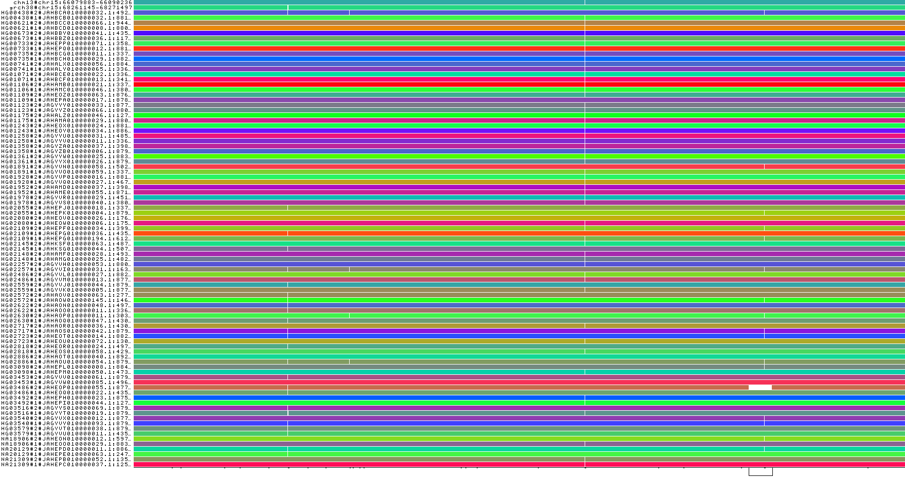

##  Population differentiation 
Fst is a statistical measure that tells us how different are two populations at the genetic level. It can be calculated for a single site, over a window (average across sites in the window), or across the entire genome. 

In this session, we are going to explore how Africans and Americans differ in allele frequencies along chromosome 15. Our main task is to understand where these genetic differences occur and - possibly - why they matter. Knowing these differences but also about learning how they could affect health and diseases in various groups.

We will learn 
- (a) how to calculate Fst between two populations using `vcftools`
- (b) how to visualize these differences
- (c) how to look for the genomic annotations at the highly diverging loci using using pangenomics 


#### Navigate to the folder `2_fst` within the `mytutorial` folder 

```shell
cd mytutorial
cd 2_fst
```

## (a) Fst calculation 
Evaluate at which loci on chromosome 15 the Africans and Americans in the HPRC differ using [vcftools](https://vcftools.github.io/). Calculate Fst index ( Weir and Cockerham’s, 1984 [PMID:28563791](https://pubmed.ncbi.nlm.nih.gov/28563791/)) along the chromosome in windows of 10,000 bp: 


```shell
vcftools --gzvcf /home/genomics/workshop_materials/population_genomics/chr15.pan.fa.a2fb268.4030258.6a1ecc2.smooth.reliable.vcf.gz \
    --weir-fst-pop ../../metadata/afr.onlyid\
    --weir-fst-pop ../../metadata/amr.onlyid \
    --fst-window-size 10000 \
    --out afr-amr.w10k 

## --weir-fst-pop specify a file that contain lists of individuals (one per line) that are members of a population. 
## The function will work with multiple populations if multiple --weir-fst-pop arguments are used.

## --fst-window-size indicate the size of the window in base pairs.

## --out afr-amr.w10k  give a meaningful name to the output, I choose the population pair 'afr-amr', 'w' for windows, '10k' window size. 
## It could be called 'banana', it won't matter.
```

This will produce: 

```shell
-rw-rw-r-- 1 enza enza    866 gen 14 11:42 afr-amr.w10k.log
-rw-rw-r-- 1 enza enza 455476 gen 14 11:42 afr-amr.w10k.windowed.weir.fst

```

As usual, read the log file very well **before** looking at the results. After that look at the results: 

```shell
cat afr-amr.w10k.windowed.weir.fst | column -t | less -S 

## the column -t indent the columns to improve readability 
```

You should see this: 

```shell
CHROM        BIN_START  BIN_END   N_VARIANTS  WEIGHTED_FST  MEAN_FST
chm13#chr15  20001      30000     212         0.032207      0.01353
chm13#chr15  30001      40000     253         0.0235088     0.0150361
chm13#chr15  40001      50000     212         0.00531486    0.00804097
chm13#chr15  50001      60000     209         0.0359234     0.0172863

```
The first line of the files says that: _In the first 10kb from 20001 to 30000 there are 212 variants and the weighted avearge Fst is 0.3_

`vcftools` reads the input VCF file and for each site (SNP), it calculates the allele counts and frequencies in each population. It then computes the expected heterozygosity (H_e), observed heterozygosity (H_o), and the number of polymorphic sites (S) for each population.

>The **FST** is calculated using the following formula:
  
where: 
- i represents a population
- Hei is the expected heterozygosity in population i 
- Hoi is the observed heterozygosity in population i  
- Si is the number of polymorphic sites
- ni is the number of individuals in population i 

>The **Weighted FST** is then computed by multiplying the unweighted FST by the harmonic mean of the number of individuals in each population: 
  
where: 
- k is the number of populations
- ni is the number of individuals in population i.


***
## (b) Fst along the chromosome 

The following step is to create a plot of the results, offering an at-a-glance overview of the chromosome's status. Key information for this plotting process can be found in the script `../../rscript/2.plotFst.R`. You have the option to either run the script from the command line or use it as a reference to develop your own code, depending on your preference and coding style.

The scripts also writes two files with loci above a specified threshold of WEIGHTED_FST and MEAN_FST. 

```shell
Rscript ../../rscripts/2.plotFst.R afr-amr.w10k.windowed.weir.fst   AFR-AMR_w10k

## first argument is the Fst result file 

## second argument is the title of the graph, you choose it, can be 'banana', just do not use space if multiple words 

```

This will produce: 

```shell
-rw-rw-r-- 1 enza enza 362716 gen 16 11:44 AFR-AMR_w10k.png
-rw-rw-r-- 1 enza enza   1305 gen 16 11:44 AFR-AMR_w10k.WEIGHTED_FST.high
-rw-rw-r-- 1 enza enza   1922 gen 16 11:44 AFR-AMR_w10k.MEAN_FST.high

```

Open png file. To view the png image, you can use Guacamole desktop or copy the file to your laptop using scp command.
<!------>


####  What do you see? What do you think is the region with missing data?  
####  What do you think about all the high Fsts in the right part pf teh graph near the missing data? 

***
## (c) Look up for highly differentiated regions 

We are interested in loci with high value of Fst because they can be indicative of population-specific genetics features, as the result of genetic drift of natural selection. Filter the files with the Fsts for WEIGHTED_FST and/or MEAN_FST greather than a threshold you like. We can use `awk`, a programming language and command-line tool used in Unix and Unix-like systems for processing and analyzing text files, particularly useful for manipulating data, generating reports, and performing complex pattern matching. 

Looking at previous plot it would be interesting to filter for WEIGHTED_FST> 0.4 or MEAN_FST>0.2: 

```shell
awk 'NR==1 || $5 > 0.4' afr-amr.w10k.windowed.weir.fst > highWeightedFst.list

## NR==1 retain the header   
## $5 >0.4 filters the fifth column, i.e. the WEIGHTED_FST, for values greather than 0.4 

awk 'NR==1 || $6 > 0.2' afr-amr.w10k.windowed.weir.fst > highMeanFst.list 
```

####  How many regions do you select? 

It would be interesting to follow up these loci with high Fst and see which information in the genome they contain. I choose to look up a region safely far from the centromere: 

```
CHROM           BIN_START       BIN_END     N_VARIANTS  WEIGHTED_FST  MEAN_FST
chm13#chr15     82970001        82980000    70          0.449617      0.249188
```

If you look up the region on the [UCSC Genome Browser](https://genome.ucsc.edu/) - making sure to select the **Human T2T-CHM13/hs1** reference sequence to match the coordinates - you will find that the 10kb window is upstream to the _ADAMTS7P4_ gene that was associated with: 
- lung function in African American children of the SAGE cohort[PMC:7902343](https://www.ncbi.nlm.nih.gov/pmc/articles/PMC7902343/) 
- red blood cell volume [PMID:30595370](https://pubmed.ncbi.nlm.nih.gov/30595370/)




####  Do you find any other interesting region? 

Let's focus on a handful of Fst peaks:

```txt
chm13#chr15     30330001        30340000
chm13#chr15     30340001        30350000
chm13#chr15     30340001        30350000
chm13#chr15     53000001        53010000
chm13#chr15     53010001        53020000
chm13#chr15     66080001        66090000
chm13#chr15     82970001        82980000
```

Basically there are four regions. Let's take a look in the pangenome.

We will work through a few examples of extracting and visualizing loci. A full workup is described in these [slides examining the Fst peaks vs. the HPRC chr15 pangenome graph.](https://docs.google.com/presentation/d/1Pu6hrvNymQgGUgOyrFARujcdCeoqqJ5LKTn-k8Ttp7M/edit?usp=sharing).

##### 1) chr15:53000001-53020000

The first peak at ~30 Mbp is embedded in a massive structural variant. That will make it harder to dissect here, so let's go to the next one, from 53000001-53020000.

We'll want to download a chr15-specific HRPC year 1 pangenome graph:

```bash
wget https://garrisonlab.s3.amazonaws.com/human/chr15.pan.fa.a2fb268.4030258.6a1ecc2.smooth.og.gz
```

This comes in the ODGI binary format, which is faster to work with than GFA for extracting regions and applying operations in `odgi`.
We start by pulling out the region in question:

```bash
odgi extract -i <(zcat chr15.pan.fa.a2fb268.4030258.6a1ecc2.smooth.og.gz ) \
    -r chm13#chr15:53000001-53020000 -d 5000000 -t 8 -P -o - \
    | odgi sort -O -i - -o hprcy1.pggb.chm13_chr15_53000001-53020000.og
```

This extraction grabs the region in question.

We can make some quick visualizations of the region with `odgi viz`:

```bash
odgi viz -i hprcy1.pggb.chm13_chr15_53000001-53020000.og -o hprcy1.pggb.chm13_chr15_53000001-53020000.og.viz.png
odgi viz -m -i hprcy1.pggb.chm13_chr15_53000001-53020000.og -o hprcy1.pggb.chm13_chr15_53000001-53020000.og.viz-m.png
odgi viz -z -i hprcy1.pggb.chm13_chr15_53000001-53020000.og -o hprcy1.pggb.chm13_chr15_53000001-53020000.og.viz-z.png
```

Take a look at these. What do you see in this region? Is there copy number variation (`*.viz-m.*` should show colors other than gray)? Is there anything strange with the orientation of paths (`*.viz-z.*`)?



We can also open this graph in Bandage to look at the nodes and extract their sequences manually.
We convert it to GFA:

```bash
odgi view -g -i hprcy1.pggb.chm13_chr15_53000001-53020000.og >hprcy1.pggb.chm13_chr15_53000001-53020000.gfa
```

Now this can be opened with Bandage (installed on your instance, you'll need to open it with Guacamole).



##### 2) chr15:66080001-66090000

On to another region!

```bash
odgi extract -i <(zcat chr15.pan.fa.a2fb268.4030258.6a1ecc2.smooth.og.gz ) \
    -r chm13#chr15:66080001-66090000 -d 5000000 -t 8 -P -o - \
    | odgi sort -O -i - -o hprcy1.pggb.chm13_chr15_66080001-66090000.og
# save a GFA, for later
odgi view -i hprcy1.pggb.chm13_chr15_66080001-66090000.og -g >hprcy1.pggb.chm13_chr15_66080001-66090000.gfa
# some visualizations
odgi viz -i hprcy1.pggb.chm13_chr15_66080001-66090000.og -o hprcy1.pggb.chm13_chr15_66080001-66090000.og.viz.png
odgi viz -m -i hprcy1.pggb.chm13_chr15_66080001-66090000.og -o hprcy1.pggb.chm13_chr15_66080001-66090000.og.viz-m.png
odgi viz -z -i hprcy1.pggb.chm13_chr15_66080001-66090000.og -o hprcy1.pggb.chm13_chr15_66080001-66090000.og.viz-z.png
```



The sample order is actually correlated to population. And, it looks like there isn't a random distribution of the indel variants across the order.

So, could we subdivide the graph into different superpopulations.

We'll use the phyton script [`replace.py`](../rscripts/replace.py).

Your superpopulations are listed in this metadata file [hprc_superpop.tsv](../metadata/hprc_superpop.tsv).

We'll use this to rewrite the path names and filter them by population group:

```bash
( grep -v ^P hprcy1.pggb.chm13_chr15_66080001-66090000.gfa;
  grep ^P hprcy1.pggb.chm13_chr15_66080001-66090000.gfa \
  |  python ../rscripts/replace.py ../../metadata/hprc_superpop.tsv | grep AFR ) \
  >hprcy1.pggb.chm13_chr15_66080001-66090000.AFR.gfa
( grep -v ^P hprcy1.pggb.chm13_chr15_66080001-66090000.gfa;
  grep ^P hprcy1.pggb.chm13_chr15_66080001-66090000.gfa \
  |  python ../rscripts/replace.py ../../metadata/hprc_superpop.tsv | grep AMR ) \
  >hprcy1.pggb.chm13_chr15_66080001-66090000.AMR.gfa
```

Now we can visualize each graph with `odgi viz`:

```bash
odgi viz -i hprcy1.pggb.chm13_chr15_66080001-66090000.AFR.gfa -o hprcy1.pggb.chm13_chr15_66080001-66090000.AFR.gfa.viz.png
odgi viz -i hprcy1.pggb.chm13_chr15_66080001-66090000.AMR.gfa -o hprcy1.pggb.chm13_chr15_66080001-66090000.AMR.gfa.viz.png
```


These look quite different, so that would support a high Fst.

##### 3) chr15:82970001-82980000

Another segmental duplication! This one is big, with ~5 Mbp between the duplicated segments.
A visualization of the whole chromosome with the region (expended to 200kbp) highlighted red shows where it sits:


Extracting it is tricky. Here's how you can pick up the entire region.

```bash
odgi extract -i <(zcat chr15.pan.fa.a2fb268.4030258.6a1ecc2.smooth.og.gz ) \
    -r chm13#chr15:77970001-84980000 -d 5000000 -t 8 -P -o - \
    | odgi sort -O -i - -o hprcy1.pggb.chm13_chr15_77970001-84980000_d5M.og
odgi viz -i hprcy1.pggb.chm13_chr15_77970001-84980000_d5M.og -m -o hprcy1.pggb.chm13_chr15_77970001-84980000_d5M.og.viz-m.png
```


The red, orange, and yellow colors indicate higher local copy number vs. the graph (2x, 3x, 4x).

This shows that the segmental duplication region contains the Fst peak.
Of course, it could be that this peak results from difficulty in establishing a correct genotyping in the locus.
However, there is strong evidence that [DNA evolution is accelerated in segmental duplications](https://doi.org/10.1038/s41586-023-05895-y).
There is more work to be done!
