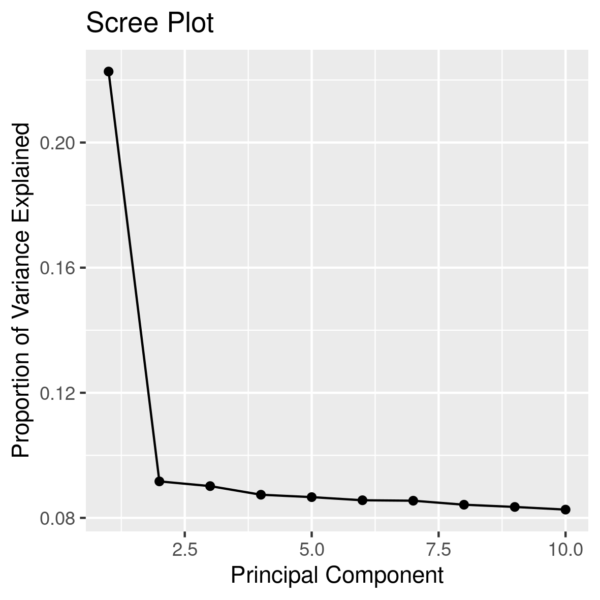
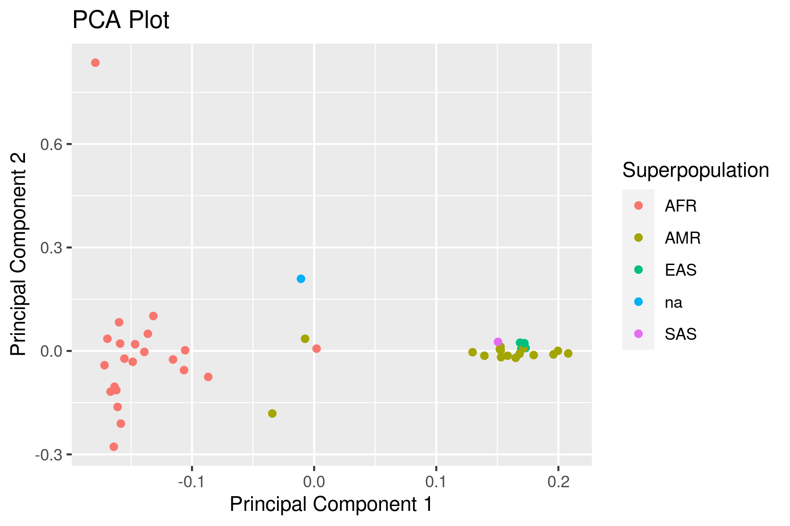

[Back to sections](/#tutorial-sections)

## Population differentiation using PCA 
_(or the lack of it on the short arms of acrocentric chromosomes)_


#### Navigate to the folder `2_fst` within the `mytutorial` folder 

```shell
cd mytutorial
cd 3_pca
```

#### Before starting: f o r m a t t i n g 

Understanding and dealing with formatting issues sometimes take more time than runnig the analyses! The VCF we are using contains repeated variant IDs. As en example if you grep for `>77497>77500`  you will find three lines corresponding to three different genomic location for which the variant ID is the same. 

```shell
chm13#chr15     68355   >77497>77500    A       T
chm13#chr15     74647   >77497>77500    A       T
chm13#chr15     80963   >77497>77500    T       A
```

This presents a challenge **specific to pangenomes** as the VCF (Variant Call Format) was not originally designed to fully represent the comprehensive information that pangenome graphs contain. In this case `>77497>77500`  represents a chunk of the genome containing multiple nested variants.  

Some of the plink (and other software) functions require unique IDs, therefore with the `--set-all-var-ids` we will convert variant IDs in the format that make them unique. We thus will recode the variant ID before proceding to pca analysis, so that they will look like this: 

```shell
chm13#chr15     68355   chm13#chr15:68355    A       T
chm13#chr15     74647   chm13#chr15:74647    A       T
chm13#chr15     80963   chm13#chr15:80963    T       A
```

To do this we will use plink and produce a new vcf using the option `--export`  and applying the `--set-all-var-ids`: 

```shell
plink2 --pfile ../data/chr15 \
       --allow-extra-chr \
       --snps-only \
       --set-all-var-ids @:#$r$a  \
       --export vcf \
       --out chr15uniqID


## --set-all-var-ids <template string>  deal with the annoying problem of having repeated variant ID in the VCF file (see explanation below this box). 
## Look at the [manual](https://www.cog-genomics.org/plink/2.0/data#set_all_var_ids) for a full explanation or at the box below for a quick one. 

## --out  name of the new vcf with the variant ID changed to be unique note that we do not need to specify file extension 
```

Open the `chr15uniqID.vcf` and look at the new variant ID. Next step is to gzip the vcf and produce the vcf index: 

```shell
bgzip chr15uniqID.vcf 
tabix -p vcf  chr15uniqID.vcf.gz
```

## PCA for the entire chromosome

<!---If you did not have enough time to refromat the vcf you can use this one already formatted: --->


#### a. Calculate allele frequencies: 
Allele frequncies where the variant ID will be corrected:

```shell
plink2 --vcf chr15uniqID.vcf.gz \
       --allow-extra-chr \
       --vcf-half-call m \
       --snps-only \
       --freq \
       --out chr15uniqID 
```

This will produce: 
```shell
-rw-rw-r-- 1 enza enza 36451525 gen 15 15:30 chr15uniqID.afreq
```

#### b. Remove GRC-hg38 
The sample named `grch38` correspond to the sequence of GRC-hg38. Because of the different sequencing methods adopted, `grch38` does not contain as much information as the other samples, therefore we will exclude it from the analysis. To do so we create a file that contain a list of individuals to be removed. This list will actually contain only `grch38`  and therefore be of length 1: 

```shell
echo grch38 > samplestoremove.list

``` 
Of course you are welcome to run the pca including `grch38`. If so, what do you expect? 

#### c. PCA 
Finally! We have all the ingredient to run a pca: a vcf with unique variant IDs, a corresponding file of allele frequencies, a file with samples to be removed form the analysis: 

```shell 
plink2 --vcf chr15uniqID.vcf.gz \
       --allow-extra-chr \
       --vcf-half-call m \
       --snps-only \
       --remove samplestoremove.list \
       --read-freq chr15uniqID.afreq \
       --pca \
       --out all


## --vcf loads a genotype VCF file
## --allow-extra-chr  force to accept chromosome code 'chm13#chr15'
## --vcf-half-call specify how GT half-call should be processed. See tutorial section 0 for more info
## --snps-only  selects only loci that are single nucleotide polymorphisms 
## --read-freq refers to the allele frequency file 
## --pca performs the pca; as default 10 components are extracted 
## --out gives a human-readable name 

```
This will produce: 

```shell
-rw-rw-r-- 1 enza enza       79 gen 15 18:08 all.eigenval
-rw-rw-r-- 1 enza enza     4866 gen 15 18:08 all.eigenvec
-rw-rw-r-- 1 enza enza     1395 gen 15 18:08 all.log
```

_From the plink [manual](https://www.cog-genomics.org/plink/2.0/formats#eigenvec):_  `.eigenvec` file is a text file with a header line and between 1+V and 3+V columns per sample, where V is the number of requested principal components. The first columns contain the sample ID, and the rest are principal component weights in the same order as the `.eigenval` values (with column headers 'PC1', 'PC2', ...)

### Explained variance 
We first want to understand how much of the total variability in the dataset is accounted for by each principal component calculating the **explained variance** for each component. It quantifies how much of the total variability in a dataset is captured by each principal component. 

To calculate the percent of explained varinace, for each principal component, divide its eigenvalue by the total sum of all eigenvalues. This gives the proportion of the variance that is explained by that particular principal component. To express this as a percentage, multiply the proportion by 100. This calculattion and its graphical representation is coded in `rscripts/3screeplot.R`

```shell
Rscript ../../rscripts/3.screeplot.R all.eigenval 
```

This should result in this image: 


### Scatter Plot 
Next we want to make a scatter plot of the first two components: 

```shell
Rscript  ../../rscripts/3.plotPCA.R all.eigenvec  ../../metadata/hprc.metadata
```
This should result in this image: 



## PCA for the p-arm and the q-arm 

Now try by yourself to implement pca only for the p-arm or the q-arm of the chromosome to see if there is a change. 
From this list of [centromeres coordinates](https://github.com/pangenome/chromosome_communities/blob/main/data/chm13.centromeres.approximate.bed) we can learn that for chr 15 the centromere is approximately between 15,412,039 bp and 17,709,803 bp. 

Our vcf spans variants from position 410 to 99,753,074: 

```shell

zcat chr15uniqID.vcf.gz | grep -v '##' | cut -f1,2  | head -2 
#CHROM  POS
chm13#chr15     410

zcat chr15uniqID.vcf.gz | grep -v '##' | cut -f1,2  | tail  -1 
chm13#chr15     99753074
```

How would you do it? 

[Back to sections](/#tutorial-sections)

<!---
We can make two sub-vcfs each containing only markers from the p-arm or the q-arm  

```shell 
bcftools view -O z  -o p-arm.vcf.gz chr15uniqID.vcf.gz  -r chm13#chr15:0-15412039 
tabix -p vcf p-arm.vcf.gz

bcftools view -O z  -o q-arm.vcf.gz chr15uniqID.vcf.gz  -r chm13#chr15:17709803-99753074 
tabix -p vcf q-arm.vcf.gz


plink2 --vcf p-arm.vcf.gz \
       --allow-extra-chr \
       --vcf-half-call m \
       --snps-only \
       --remove samplestoremove.list \
       --read-freq chr15uniqID.afreq \
       --rm-dup exclude-mismatch \
       --pca \
       --out p-arm

plink2 --vcf q-arm.vcf.gz \
       --allow-extra-chr \
       --vcf-half-call m \
       --snps-only \
       --remove samplestoremove.list \
       --read-freq chr15uniqID.afreq \
       --pca \
       --out q-arm
```


```
for ass in chm13 hg38; do for c in $(seq 1 22); do 
plink2 --vcf chr$c.confident.SNPs.noRef.recode.vcf.gz\
--double-id \
--set-all-var-ids @:#$r:$a \
--rm-dup exclude-mismatch \
--vcf-half-call m \
--maf 0.01 \
--freq \
--out chr$c.confident.SNPs | \
plink2 --vcf chr$c.confident.SNPs.noRef.recode.vcf.gz \
--double-id \
--set-all-var-ids @:#$r:$a \
--rm-dup exclude-mismatch \
--vcf-half-call m \
--make-bed \
--read-freq chr$c.confident.SNPs.afreq \
--pca \
--out chr$c.confident.SNPs ; done
```
#### 7. Extract variants on p arm
```
for c in $(seq 1 22); do 
bcftools view -R chr$c.chm13.pArm_coord.txt \
-O z \
-o chr$c.confident.SNPs.pArm.vcf.gz chr$c.confident.SNPs.noRef.recode.vcf.gz | \
tabix -p vcf chr$c.confident.SNPs.pArm.vcf.gz; done
```
#### 8. Extract variants on q arm
```
for ass in chm13 hg38; do for c in $(seq 1 22); do
bcftools view -R chr$c.chm13.qArm_coord.txt \
-O z \
-o chr$c.confident.SNPs.qArm.vcf.gz \
chr$c.confident.SNPs.noRef.recode.vcf.gz | \
tabix -p vcf chr$c.confident.SNPs.qArm.vcf.gz; done
```
#### 9. PCA using variants on p and q arms

#### 10. Cluster analysis and plot
```
Rscript scr/clusterAnalysis.R \
pathToImputFiles \
length \
assembly \
method \
pathToOutputFile


Rscript scr/plotClustersHprc.R \
pathToImputFiles \
pathToPlot
```

#### 11. PCA plot
```
## put together eigenvec files
python3 scr/appendEigenvec.py \
-i "pathToImputFiles" \
-met method \
-ass assembly \
-len lehgth \
-o pathToOutputFile

Rscript scr/PCA_plot.R "pathToImputFiles" \
met \
pathToOtputPlot
``` 
---> 
